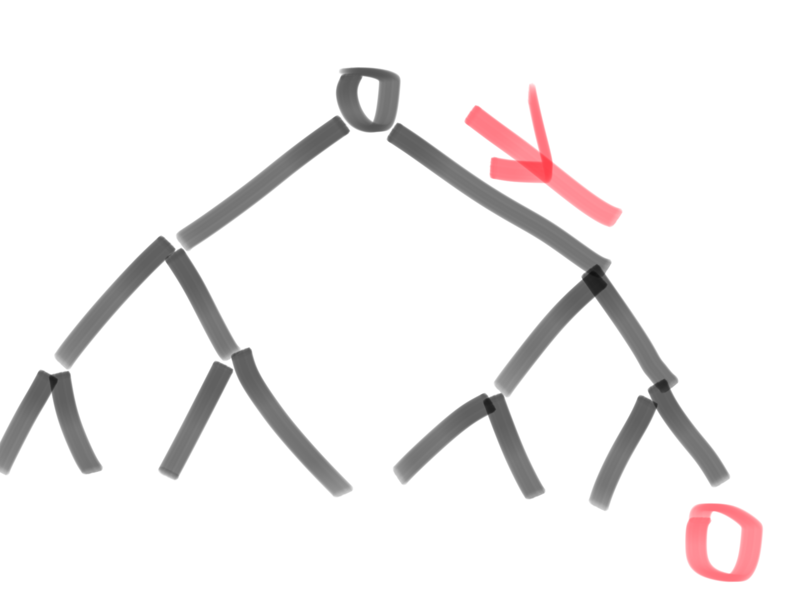
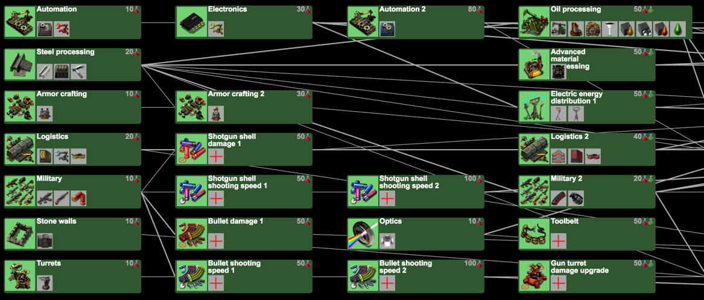

今天瞄看到了微博上[一篇文章](http://weibo.com/ttarticle/p/show?id=2309351000354081521140058311)，其中又举了这个 QWERTY 键盘这个例子，称它的成功是「路径依赖和商业运作的共同结果」。「路径依赖」这个词好熟悉，似乎大三经济课的时候也讲到过 path dependence 相关的东西，但忽然一时间就是想不起来了。键位能依赖什么路径啊？

> 按照字面意思脑补出来的理解……从黑点到红点必须经过这个路径。这就叫路径依赖？

### 什么是路径依赖（path dependence）

路径依赖是指，在任何情况下人们面对的一系列选择枝是受到之前选择的影响的，即使这些过去状态与现在的情况毫不相关。

在日常使用中，这个词语有两个解释：
* 历史、过去是重要的——一个宽泛的概念。
* 我们可能会预测到，事物之间的微小差别会在将来被放大，它们可能体现在将来的情况中。如果一件事情的路径依赖性很强，那么可能我们之后可能再也无法改变现状了。

维基的解读看起来很爽，因为它严谨地分出了两个解读，并认为第一种是废话（<del>这一点上达成了共识所以看起来特别愉悦</del>）

### 一个例子，经济学论文里是怎么讲路径依赖的
Cohen 和 Levinthal 在[一篇讨论组织学习和创新的论文中](https://www.uzh.ch/iou/orga/ssl-dir/wiki/uploads/Main/v28.pdf)认为，个人和组织吸收外界知识并创新的能力（absorptive capacity）很大程度取决于它之前积累的知识，即公司在某领域的创新非常依赖路径。先前的知识可能与新知识关系密切，也有可能貌似毫不相关。不过，这些之前的知识是之后创新的基础，它能让人们在下一阶段的学习更加有效率。

这篇论文中还举了一个例子，上世纪的晶片制造商 Mansando（之后改名为 SunEdison）的失败，很大程度归因于它做了一个错误的决策。科技是一个路径依赖很强的东西，而 Mandando 竟然就在紧要关头放弃了晶片制造业务，这导致它之后完全无法跟上计算机相关的科技产品制造。「你一旦下了科技的电梯，你就很难再乘上去了」。

这么一说就有一种中学数学老师常说的「你这个单元不学好，之后的课就更加听不懂了」的感觉。或者拿游戏的科技树来举例更加直观，如果你要有电子技术，必须先有自动化。

> 快来玩 Factorio

### 所以，QWERTY 键盘的路径依赖是什么？
再简单介绍一下 QWERTY 事件：这个键位的打字机最先在市面上出现，因为它的手感好立刻就流行了起来。[打字培训班采用的键位就是 QWERTY](http://eh.net/encyclopedia/path-dependence/)。不过它的键位不能说好记，常用的字母都没有排在一起。之后，德沃夏克打字机改进了键位，但是人们已经习惯了 QWERTY，所以……它就败了。

这样来看，QWERTY 到底依赖了什么路径？在这个路径的树状图中，和 QWERTY 并列的选择枝还有什么？

最初的分支似乎是打字培训班的键位选择。QWERTY 键盘赢下了培训班这一步至关重要的棋。

